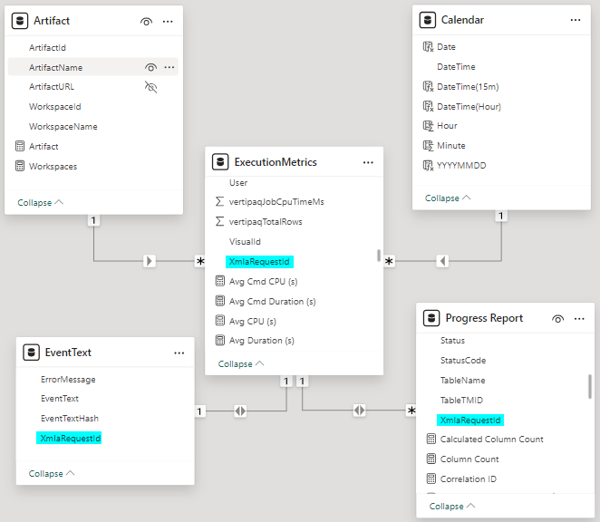
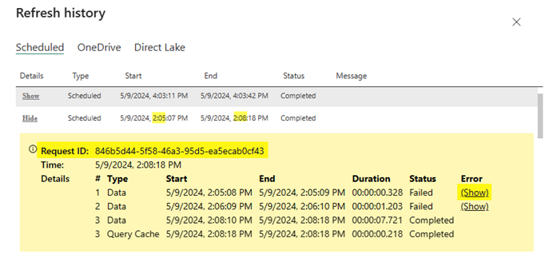
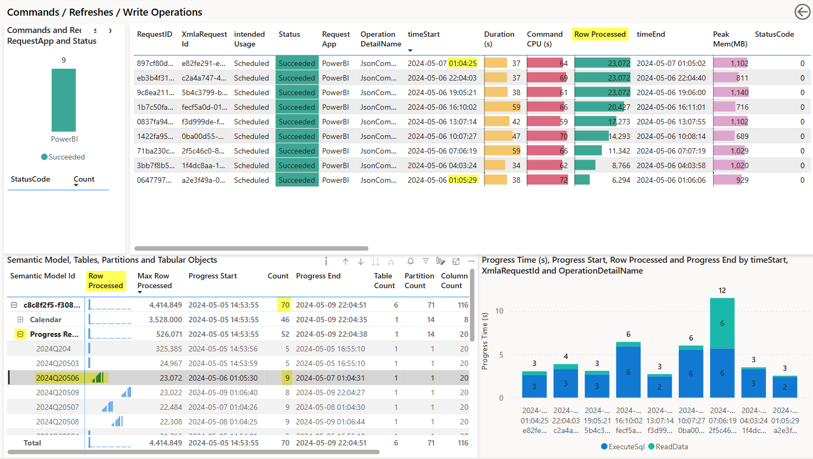
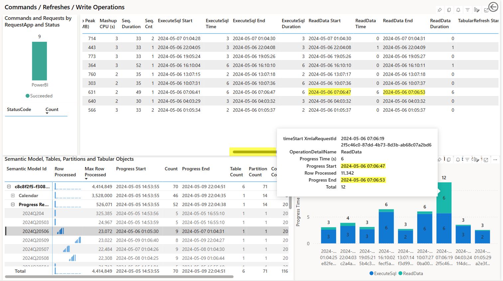
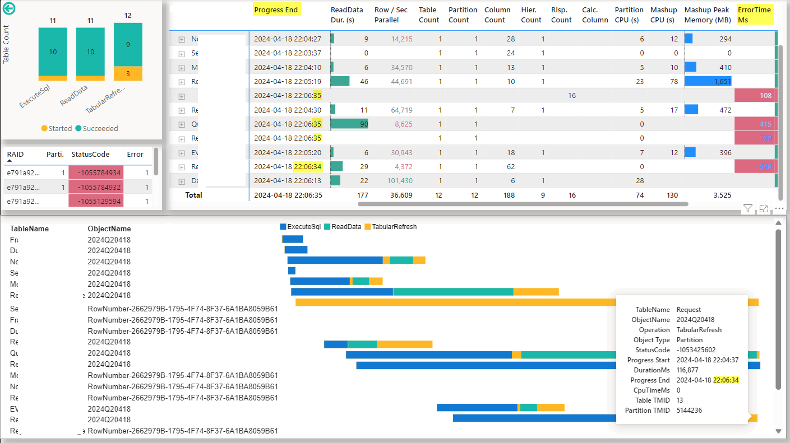
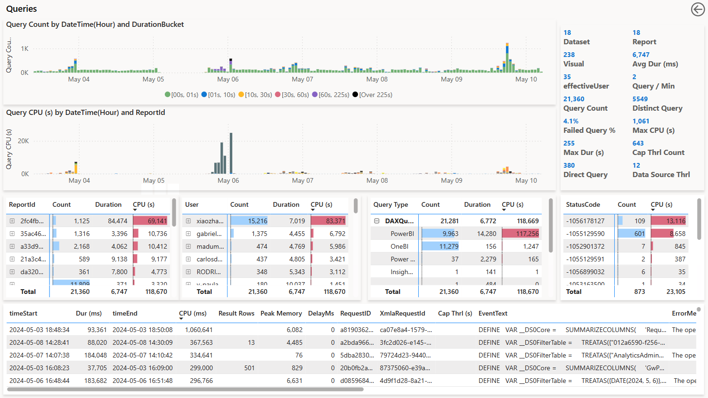

# Fabric Log Analytics for Analysis Services Engine report template

This template adds the model layer to the ocean of the Analysis Services engine trace events and enables you to go from data to insight to action quickly.

Download Power BI report template: [here](./FabricASEngineAnalytics.pbit)

The following video shows how to utilize Log Analytics along the report template to better diagnose Fabric Capacity throttling scenarios:

## Setup

The following parameters are defined in the template:

|**Parameter**  |**Description**  |
|---------|---------|
|Azure Log Analytics Workspace Id |Globally unique identifier (GUID) of the Azure Log Analytics workspace containing the AS Engine data.|
|Days Ago To Start |Load data from the specified day to the time the call was initiated. The maximum value you can select is 30 days. However, your Premium capacity memory limits apply to this parameter. If those limits are exceeded, the template might fail to refresh. |
|Days Ago To Finish |Load data up to the specified number of days ago. Use 0 for today. |
|UTC Offset Hours |An hourly offset used to convert the data from Coordinate Universal Time (UTC) to a local time zone. |
|Fabric Workspace Id |Optionally enter a fabric workspace Id. |
|Fabric Item Id |Optionally enter a fabric artifact (semantic model) Id. |

## Report

### Data Model
The model has the following tables and the relationships:
* Calendar
  * 30s granularity.
  * Has columns such as Date and Hour fed into the "Filters on all pages" section.
* Artifact
  * This is a calculated table based on the ExecutionMetrics table.
  * Has columns such as WorkspaceId, WorkspaceName, ArtifactId/Semantic Model Id, ArtifactName/Semantic Model Name fed into the "Filters on all pages" section.
* ExecutionMetrics
  * This is a list of all the XmlaRequestId that has ExecutionMetrics and can be associated with a semantic model. Plus, the XmlaRequesstId can associated with a semantic model but no ExecutionMetrics (on-going refreshes or missing traces).
  * Has many to one relationship to the Calendar and Artifact tables.
  * Has columns such as CapacityId, XmlaRequestId, ApplicationName, RequestApp, EffectiveClaims/Identity, Status, StatusCode fed into the "Filters on all pages" section.
* EventText
  * This is a list of the XmalRequestId with their EventText and EventTextHash for user queries, refresh commands, and other operations such as backup, restore, or deployment using the XMLA endpoint.
  * Has one to one relationship to the ExecutionMetrics table.
  * Having this in a separate table allows the ExecutionMetircs table to hit the [Log Analytics Query Limits](#considerations-and-limitations) at a later point.
* Progress Report
  * Details of the data refresh at the table and partition level.
  * Has many to one relationship to the Command table.
  * Feeds into the "Command/Refresh" page and the Drill through page: "Refresh details".
   

### Page: Overview

* Execution
  *  Drill down the chart to 30s granularity.
  *  From the Card visual Drill through to the "Query" or "Command/Refresh" page.
  *  From the Table visual Drill through to the "Query" or "Command/Refresh" page carrying the semantic model as a filter.
       

* Command/Refresh
  * For scheduled and on-demand refresh, the RequestID is corresponding to the Request ID in the refresh history which can have multiple re-tries.

       

       

  * StatusCode helps to group the refreshes with the same error. While it is not publicly documented, we can tell what it represents from the error message:

       

  * Expand the semantic model table to view the partitions, selecting a partition to cross filter the table above as well as the column chart next to it. In the following example:
    * The selected partition is created by the incremental policy at 1am.
    * Scheduled to refresh every three hours and row processed keeps increasing.
    * Additionally, a refresh at 1am the subsequent day guarantees that partitions transitioning from the incremental refresh window to the historical window (where they will no longer be refreshed) receive a final update that ensures that they are up to date.
    * In total, this partition is refreshed 9 times while the semantic model is refreshed 70 times.
       

    * Scroll the table to the right to view the ExecuteSql and ReadData information in the table view corresponding to the column chart.
       

  * Hover over or right click a XmlaRequestId to drill thorough to the Refresh detail page: use the Progress End time and the millisecond columns to figure out which partition failed first.
       

* Query
  * Review the CPU and duration by ReportId, User, Query Type, StatusCode. For a high CPU or long duration query/XmlaRequestId, filter by EventTextHash to review the performance of the same query over the time.
       

## Considerations and limitations

* Log Analytics Query Limits

  * Kusto has limits in terms of the number of records returned and the overall size of the data based on the query. For more information, see [Query Limits](https://learn.microsoft.com/azure/data-explorer/kusto/concepts/querylimits) and [Data is truncated](https://learn.microsoft.com/en-us/power-bi/connect-data/incremental-refresh-troubleshoot#problem-data-is-truncated).

  * If the template refresh fails or data is truncated due to the previously mentioned data limits, you can lower the amount of data retrieved from Log Analytics by reducing the date range and/or filter by a workspace or semantic model.

* Missing traces

  * Missing traces might result from transient issues. For instance, a XmlaRequestId may have a CommandBegin but lack a CommandEnd or ExecutionMetrics trace. If there are traces of later refreshes, it is likely that the prior trace was simply missing.
